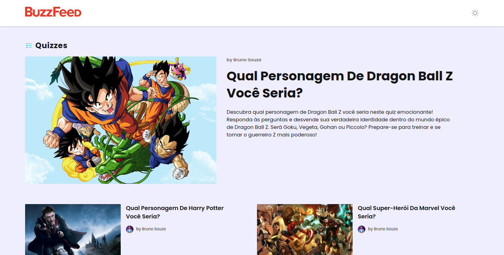

<h1 align="center">
    BuzzFeed
</h1>

    Já imaginou sendo algum personagem daquela sua história favorita? Descubra qual você seria!

  <a href="#objetivo">Objetivo</a>&nbsp;&nbsp;&nbsp;|&nbsp;&nbsp;&nbsp;
  <a href="#tecnologias">Ferramentas</a>&nbsp;&nbsp;&nbsp;|&nbsp;&nbsp;&nbsp;
  <a href="#ideias">Ideias realizadas</a>&nbsp;&nbsp;&nbsp;|&nbsp;&nbsp;&nbsp;
  <a href="#projeto">Projeto</a>&nbsp;&nbsp;&nbsp;|&nbsp;&nbsp;&nbsp;
  <a href="#layout">Layout</a>

  

  

<h2 id="objetivo">🚀 <b>Objetivo:</b></h2>

- Desenvolver um clone do [BuzzFeed](https://www.buzzfeed.com/quizzes) com Angular.

<h2 id="tecnologias">🔧 <b>Ferramentas:</b></h2>

- [Angular](https://angular.io/) v16
- [TypeScript](https://www.typescriptlang.org/docs/handbook/release-notes/typescript-5-0.html) v5
- [ChatGPT](https://openai.com/blog/chatgpt)
- HTML e CSS
- Git e GitHub

<h2 id="ideias">💡 <b>Ideias realizadas:</b></h2>

- Dark mode
- Responsividade
- Criação das perguntas/respostas por IA (ChatGPT) 
- Animação de carregamento (loading)
- Cinco (5) quizzes
- Rotas Angular (routing module)
- Tipagem do [JSON](./src/assets/data/dataModel.ts) com os dados dos quizzes
- Dinamismo ao criar novos quizzes
    - Para criar um novo quizz, apenas adicione-o ao [JSON](./src/assets/data/data.ts) (seguindo o modelo dos anteriores) 

<h2 id="projeto">💻 <b>Projeto:</b></h2>

- [Veja o projeto online]()

<h2 id="layout">🎨 <b>Layout:</b></h2>

- [Sara Viscardi | BuzzFeed ReDesign](https://www.behance.net/gallery/143604981/BuzzFeed-ReDesign?tracking_source=search_projects%7Cbuzzfeed)
- [Oleh | Redesign for BuzzFeed](https://dribbble.com/shots/10865463-Redesign-for-Buzzfeed-Concept)
- [Ishwari Raut e Jinal Patwa | Redesigning Tasty by BuzzFeed](https://www.behance.net/gallery/125174073/Redesigning-Tasty-by-BuzzFeed)

 

  Feito com 💜 por mim | Bruno Souza

